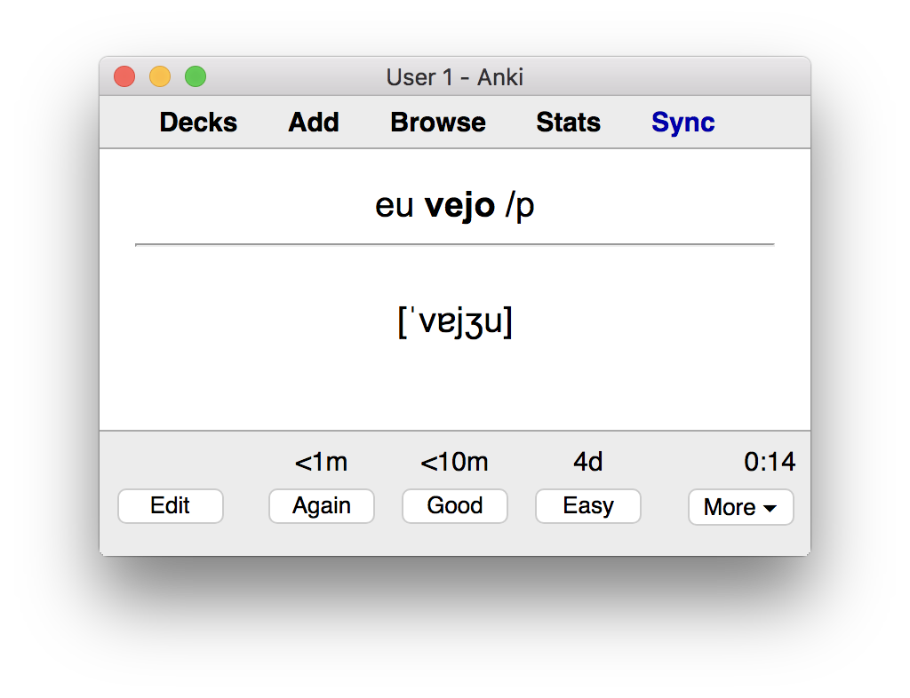
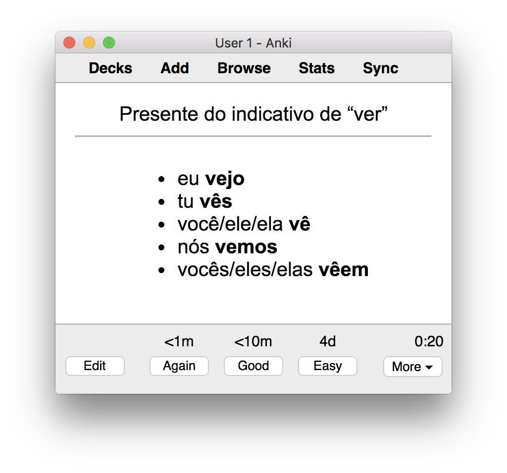
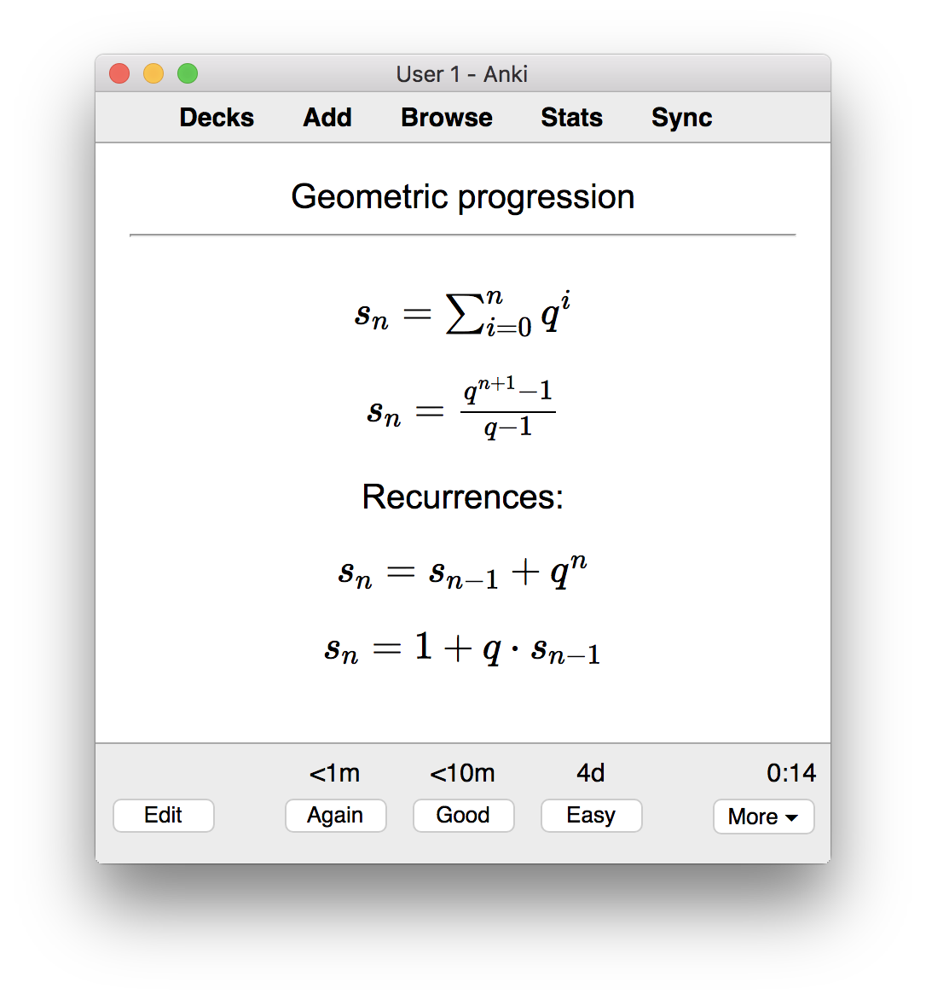
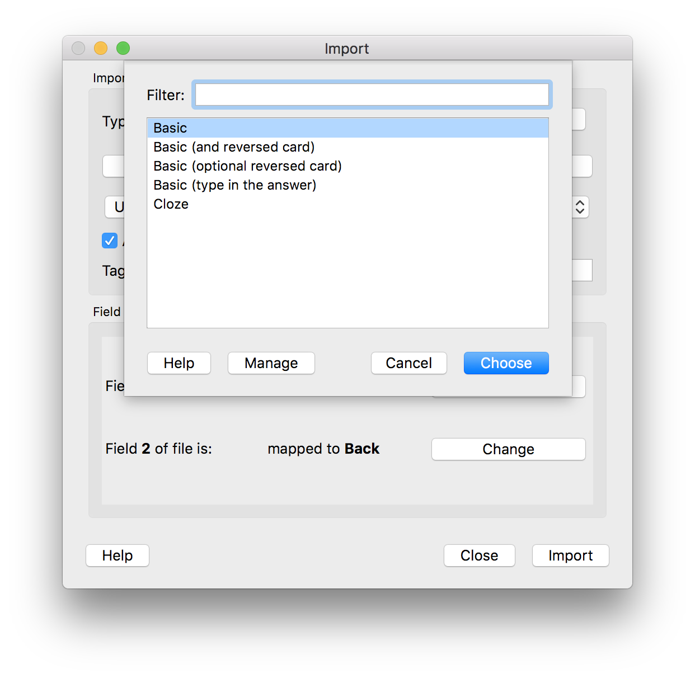
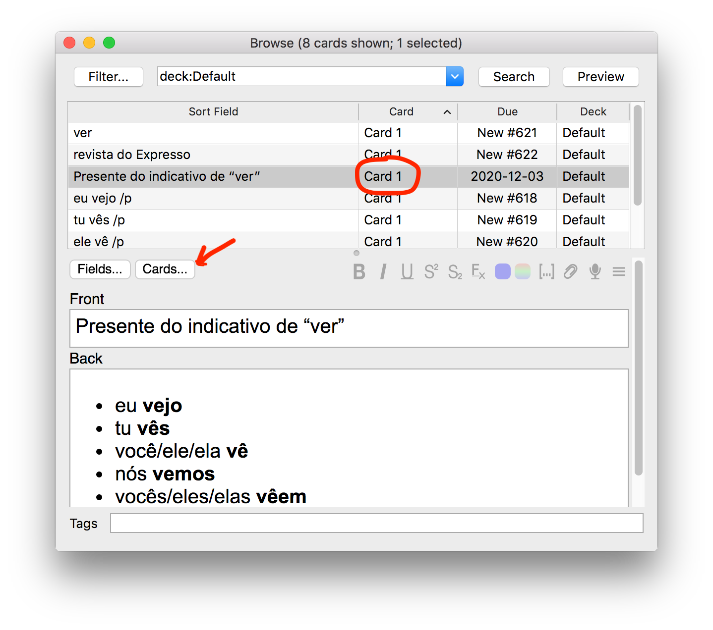
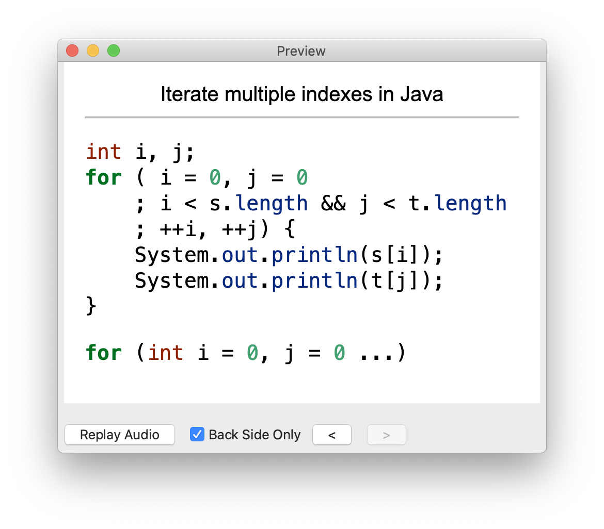

Manage Anki cards with Markdown
===============================

Manage your Anki flashcards with Markdown so that you have a uniform
experience within your favorite text editor if you prefer Markdown format.

You may find this useful if

1. You prefer a text editor over a GUI, and
2. You prefer Markdown to manage your documents.

If you happen to like Emacs and `org-mode`, then you should
check out [`anki-editor`][anki-editor].

Unlike `anki-editor`,
this tool doesn't synchronize a text file contents with Anki,
but it converts a card deck in simple Markdown format to Anki import
files. You have to import the files to Anki manually after conversion.

Deck format
-----------

A file in Markdown format represents a deck of cards.
Header (header 2) serves as a deck name followed by an unordered list.
Each element of the list is a separate card.

Here is a sample of cards from a deck on Portuguese "Irregular verbs"
to serve as an example:

```
Irregular verbs
---------------

- ver -- to watch; to see; to view
- Presente do indicativo de "ver"

    - eu __vejo__
    - tu __vês__
    - você/ele/ela __vê__
    - nós __vemos__
    - vocês/eles/elas __vêem__

- eu __vejo__ /p -> [ˈvɐjʒu]
- tu __vês__ /p -> [ˈveʃ]
- ele __vê__ /p -> [ˈve]
```

A bi-directional card (card and reversed card at the same time)
is represented by a single paragraph list element having a dash (`--`)
to separate a front of a card and a back of the card. For example:

```
- ver -- to watch; to see; to view
```

A single paragraph list element with an arrow (`->`) instead
of a dash represents a uni-directional card:

```
- eu __vejo__ /p -> [ˈvɐjʒu]
```

This card looks as follows when imported. You may notice that
markdown formatting and Unicode is respected.



A multi-paragraph list element represents a uni-directional card, like:

```
- Presente do indicativo de "ver"

    - eu __vejo__
    - tu __vês__
    - você/ele/ela __vê__
    - nós __vemos__
    - vocês/eles/elas __vêem__
```



Latex math support
------------------

Markdown math is supported, for example:

```
- Geometric progression

    $s_n = \sum_{i=0}^n q^i$

    $s_n = {q^{n + 1} - 1 \over q - 1}$

    Recurrences:

    $s_n = s_{n - 1} + q^n$

    $s_n = 1 + q \cdot s_{n - 1}$
```



Build
-----

Build and execute with [Haskell `stack`][haskell-stack]:

```
$ stack build
$ stack exec -- ankiMd test/valid.md
test/valid-uni written
test/valid-bi written
```

Or, install globally:

```
$ bash install.sh
[sudo] password for XXXX: *********
$ ankiMd test/valid.md
test/valid-uni written
test/valid-bi written
```

Usage
-----

You provide a Markdown file with cards deck as an argument
to the `ankiMd` command, and it outputs files with `-uni` and `-bi`
suffixes in Anki import format:

```
$ ankiMd test/valid.md
test/valid-uni written
test/valid-bi written
```

You will import the resulting file with the `-uni` suffix to Anki as the "Basic" card type. A file with the `-bi` suffix -- as the "Basic (and reversed card)" type.



Run with Docker
---------------

I can create a Docker image to run `ankiMd` if any user is interested. Please, create a GitHub issue if you want this to be supported.

Web UI
------

I can create a Web UI to convert from Markdown to Anki import format
if any user is interested. Please, create a GitHub issue if you want this to be supported.

Setup card styles for HTML lists
--------------------------------

If you want Anki to render HTML lists nicely,
then you should set up card CSS styles as follows.

Click "Cards..." when editing or browsing a card,
select any card with "Card 1" value in "Card" column:



Click the "Styling" radio button and paste the following into
a large text area:

```css
.card {
  font-family: arial;
  font-size: 20px;
  text-align:center;
  color: black;
  background-color: white;
}
ul {
  display: inline-block;
  text-align: left;
}
ol {
  display: inline-block;
  text-align: left;
}
```

Update templates and styling for the "Card 2" type.
Select any card with "Card 2" value in "Card" column
and paste the same style.

Setup card styles for source code
---------------------------------

An example card like this, may be rendered with source code highlighting and
alignment of the source code to the lift:

```
- Iterate multiple indexes in Java

    ```java
    int i, j;
    for ( i = 0, j = 0
        ; i < s.length && j < t.length
        ; ++i, ++j) {
        System.out.println(s[i]);
        System.out.println(t[j]);
    }
    ```

    ```java
    for (int i = 0, j = 0 ...)
    ```
```

As follows:



You should update card CSS styles the same way as in
"Setup card styles for HTML lists", but **append** (not replace)
contents of [this css file](source_code.css)
to that's already setup for HTML lists.

[anki-editor]: https://yiufung.net/post/anki-org/
[haskell-stack]: https://docs.haskellstack.org/en/stable/install_and_upgrade/
